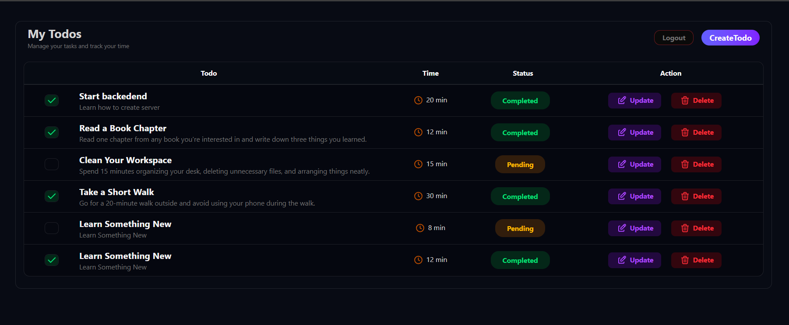

# NexTask 🚀

A modern full-stack Todo application built with the MERN stack that helps users manage tasks efficiently with authentication, task tracking, and estimated completion times.

---

## Deployment Link
https://nextask-t3ea.onrender.com/

---

## Preview

### All Todos Dashboard

---

## ✨ Features

### Authentication

* User Registration
* User Login
* JWT Authentication
* Protected Routes
* Password Hashing using bcrypt

### Todo Features

* Create Todo
* View All Todos
* Update Todo
* Delete Todo
* Mark Todo as Completed/Pending
* Estimated Time for Each Task
* Users can access only their own todos

---

## 🛠️ Tech Stack

### Frontend

* React
* React Router
* React Form
* Axios
* Tailwind CSS

### Backend

* Node.js
* Express.js
* MongoDB
* Mongoose
* JWT
* bcrypt

---

## 📖 Learning Objectives

This project demonstrates:

* REST API Design
* Authentication and Authorization
* JWT Implementation
* Password Hashing
* MongoDB Relationships
* CRUD Operations
* Express Middleware

---

# NexTask

### Plan • Track • Complete ✅
